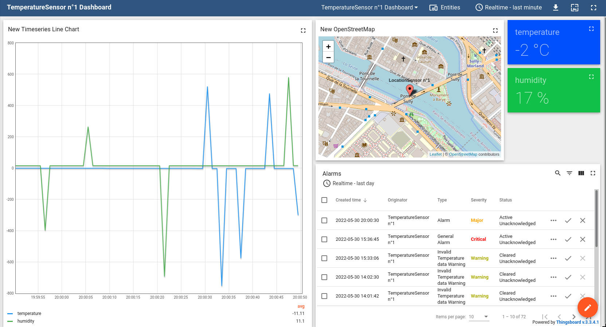

# IOT_TB

## Introduction

This EPITECH project is an Internet of Things (IOT) introduction.
The purpose of this project is to implement and understand the functioning of an IOT architecture.

## Our Architecture

We have 3 elements in our architecture:
- A server
- A front Web Application
- ThingsBoard

All theses elements are linked through CoAP communication.

## Devices

This project required the creation of 3 differents IOT Device types:
  - A light Sensor with geolocation
  - Temperature & Humidity Sensor with geolocation
  - Fluid Sensor with geolocation

For each device type we create 3 sensors, so, we have 9 sensors. However, by including all the geolocation sensors (9).
We have a total of **18 sensors**.

All the sensors will be detailled in the **back** part of the project.

## Thingsboard Dashboards

