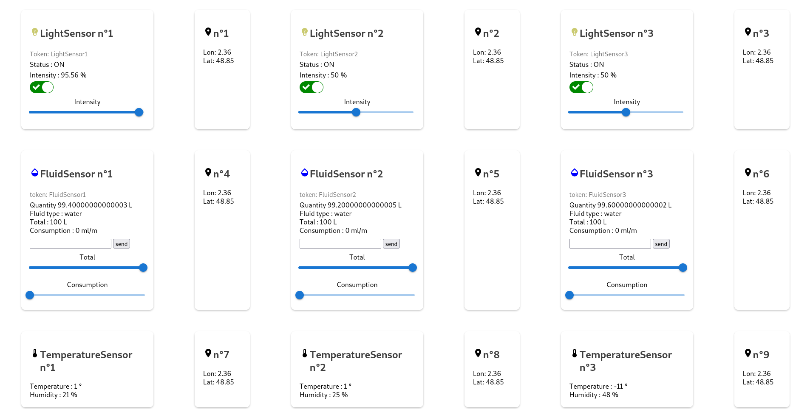
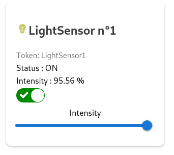
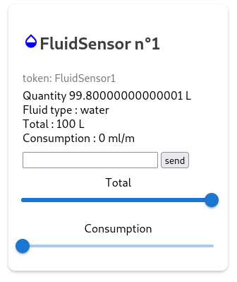
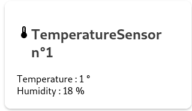
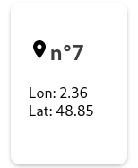

# Getting Started with Create React App

This project was bootstrapped with [Create React App](https://github.com/facebook/create-react-app).

## Available Scripts

In the project directory, you can run:

### `yarn start`

Runs the app in the development mode.\
Open [http://localhost:3000](http://localhost:3000) to view it in your browser.

The page will reload when you make changes.\
You may also see any lint errors in the console.

## Web app

## Sensors

### Light Sensor

you can manage the status of the light, change its intensity and see its status directly.

### Fluid Sensor 

you can manage the quantity of fluid available, its consumption and indicate which type of fluid it is

### Temperature/Humidity Sensor

You can see the temperature and humidity of the place where your sensor is located

### Location Sensor

You can see the longitude and latitude of the location of your sensor

